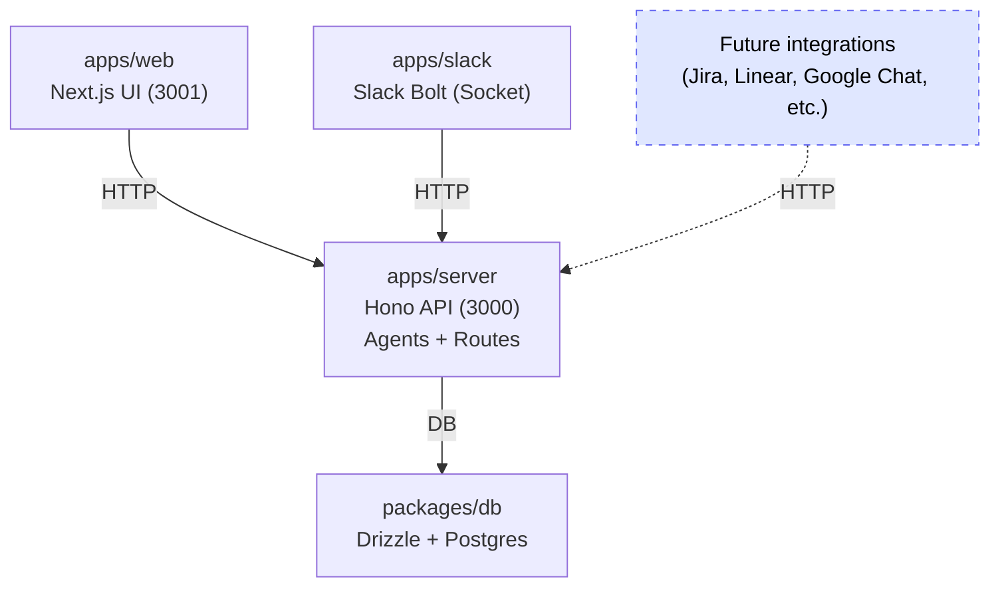
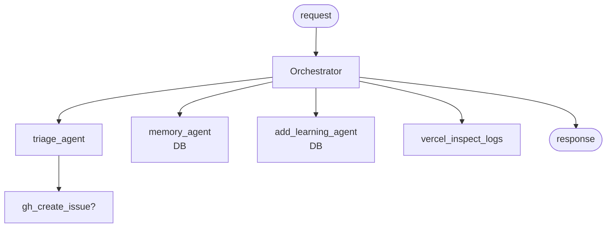
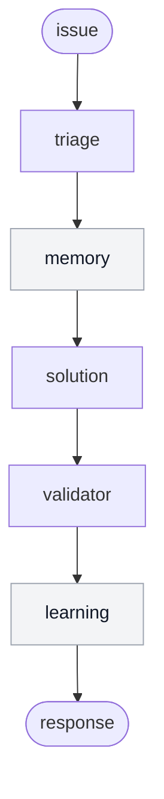

# hermes

 

## Features

- **TypeScript** - Type safety
- **Next.js** - Web app
- **Hono** - API server
- **Slack Bolt** - Slack bot
- **OpenAI Agents SDK** - Multi-agent workflows
- **TailwindCSS + shadcn/ui** - UI
- **Drizzle + PostgreSQL** - DB
- **Turborepo + pnpm workspaces** - Monorepo
- **Ultracite** - Lint/format

## Getting Started

First, install the dependencies:

```bash
pnpm install
```

## Database Setup

This project uses PostgreSQL with Drizzle ORM.

1. Make sure you have a PostgreSQL database set up.
2. Update your `apps/server/.env` file with your PostgreSQL connection details.

3. Apply the schema to your database:

```bash
pnpm run db:push
```

Then, run the development server:

```bash
pnpm run dev
```

Open [http://localhost:3001](http://localhost:3001) in your browser to see the web application.
The API is running at [http://localhost:3000](http://localhost:3000).

## Architecture

Monorepo split by runtime:

- `apps/web`: Next.js 16 app router UI
- `apps/server`: Hono API + OpenAI agent workflows
- `apps/slack`: Slack bot (Socket Mode) calling agent API
- `packages/db`: Drizzle + Neon serverless client + schema
- `packages/env`: Typed env loaders for server/web/slack
- `packages/config`: Shared config (Biome/TS)

## How It Works

-
### Architecture Diagram (Mermaid)



**Modular Architecture**: The agent API is designed to be integration-agnostic. Any client can call the HTTP endpoints, making it easy to add new integrations like Jira, Linear, Google Chat, or any other platform that can make HTTP requests.

- Web calls API via `NEXT_PUBLIC_SERVER_URL`.
- API exposes agent endpoints and orchestrates multi-agent flows.
- Slack bot receives messages, stores thread context, calls agent API, replies in thread.
- Learnings and thread history persist in Postgres via Drizzle.

### Agent Flows

- Orchestrator: tool-calls triage, memory, learning, vercel logs.
- Sequential: triage -> memory -> solution -> validator -> learning.
- Memory: fetch recent learnings from DB.

### Agent Flow Diagrams (Mermaid)

Orchestrator:



Sequential:



### Observability

- Set `HERMES_AGENT_TRACE_CONSOLE=1` to print agent traces to console.

## API Endpoints

- `POST /agents/orchestrator` body `{ "prompt": string }` -> `{ result }`
- `POST /agents/triage` body `{ "incident": string }` -> `{ result }`
- `POST /agents/memory` body `{ "question": string }` -> `{ result }`
- `POST /agents/sequential` body `{ "issue": string }` -> `{ issue, triage, memory, solution, valid, notes }`

## Data Model (DB)

- `learnings`: issue + solution memory.
- `threads`: external thread metadata (Slack).
- `thread_messages`: per-thread message log.

## Environment Variables

Server (`apps/server`):

- `DATABASE_URL`
- `CORS_ORIGIN` (optional)

Web (`apps/web`):

- `NEXT_PUBLIC_SERVER_URL`

Slack (`apps/slack`):

- `SLACK_BOT_TOKEN`
- `SLACK_APP_TOKEN`
- `AGENT_SERVER_URL`

## Git Hooks and Formatting

- Check: `pnpm run check` or `pnpm dlx ultracite check`
- Fix: `pnpm run fix` or `pnpm dlx ultracite fix`

## Project Structure

```
hermes/
├── apps/
│   ├── web/         # Frontend application (Next.js)
│   └── server/      # Backend API (Hono)
│   └── slack/       # Slack bot (Bolt)
├── packages/
│   ├── db/          # Drizzle + schema
│   ├── env/         # Typed env config
│   ├── config/      # Shared config
```

## Available Scripts

- `pnpm run dev`: Start all applications in development mode
- `pnpm run build`: Build all applications
- `pnpm run dev:web`: Start only the web application
- `pnpm run dev:server`: Start only the server
- `pnpm run check-types`: Check TypeScript types across all apps
- `pnpm run db:push`: Push schema changes to database
- `pnpm run db:studio`: Open database studio UI
- `pnpm run check`: Run Biome formatting and linting

This project was created with [Better-T-Stack](https://github.com/AmanVarshney01/create-better-t-stack), a modern TypeScript stack that combines Next.js, Hono, and more.
